# Debugging Workflows

This document provides guidance for choosing and executing the right debugging workflow with `mcp-dap-server`.

## Quick Decision Table

| Scenario | Mode | Debugger | Tool / Prompt |
|----------|------|----------|---------------|
| Debug Go source code | `source` | `delve` | `debug-source` prompt / skill |
| Debug C/C++ source code | `binary`* | `gdb` | `debug-source` prompt / skill |
| Attach to running process | `attach` | `delve` or `gdb` | `debug-attach` prompt / skill |
| Analyze a crash (core dump) | `core` | `delve` or `gdb` | `debug-core-dump` prompt / skill |
| Debug a compiled binary | `binary` | `delve` or `gdb` | `debug-binary` prompt / skill |

*GDB does not support compiling from source — compile with `gcc -g -O0` first.

---

## Scenario Workflows

### 1. Live Source Debugging (Go)

```mermaid
flowchart TD
    A[Identify bug or behavior to investigate] --> B[debug&#40;mode='source', path=..., debugger='delve'&#41;]
    B --> C[Set breakpoints at suspected locations]
    C --> D[continue&#40;&#41;]
    D --> E{Stopped at breakpoint?}
    E -- yes --> F[context&#40;&#41; — inspect location, stack, variables]
    E -- no --> G[Program terminated — check for panic/error]
    F --> H{Values correct?}
    H -- yes --> I[step&#40;mode='over'&#41; or continue&#40;&#41; to next point]
    H -- no --> J[evaluate&#40;&#41; to inspect specific values]
    I --> H
    J --> K[Identify root cause]
    K --> L[stop&#40;&#41;]
```



**Key tools:** `debug`, `breakpoint`, `continue`, `step`, `context`, `evaluate`, `info`, `stop`

**Typical sequence:**
1. `debug(mode="source", path="/path/to/main.go")`
2. `breakpoint(file="/path/to/file.go", line=42)`
3. `continue()` — runs to breakpoint
4. `context()` — inspect full state
5. `evaluate(expression="variableName")` — drill into specifics
6. `step(mode="in")` — follow execution into a suspicious function
7. `stop()` — when done

---

### 2. Live Attach Debugging

```mermaid
flowchart TD
    A[Find PID: ps aux or pgrep] --> B[debug&#40;mode='attach', processId=PID&#41;]
    B --> C[context&#40;&#41; — what is the process doing right now?]
    C --> D[info&#40;kind='threads'&#41; — check all goroutines/threads]
    D --> E{Multiple threads suspicious?}
    E -- yes --> F[context&#40;threadId=N&#41; for each suspicious thread]
    E -- no --> G[Set targeted breakpoints at suspicious functions]
    F --> H{Deadlock pattern?}
    H -- yes --> I[Document lock ordering issue]
    H -- no --> G
    G --> J[continue&#40;&#41; — let process run to breakpoint]
    J --> K[Inspect state at breakpoint]
    K --> L[Conclude and stop&#40;&#41;]
```



**Key tools:** `debug`, `pause`, `context`, `info`, `breakpoint`, `continue`, `evaluate`, `stop`

**Typical sequence:**
1. `debug(mode="attach", processId=12345)`
2. `context()` — immediate state
3. `info(kind="threads")` — all threads
4. `context(threadId=<N>)` — per suspicious thread
5. `pause()` then `context()` — sample execution multiple times for CPU diagnosis
6. `stop()`

---

### 3. Post-Mortem Core Dump Analysis

```mermaid
flowchart TD
    A[Locate binary and core dump file] --> B[debug&#40;mode='core', path=..., coreFilePath=...&#41;]
    B --> C[context&#40;&#41; — crash location, signal, variables]
    C --> D[Check signal type]
    D -- SIGSEGV --> E[Look for nil pointers or OOB access]
    D -- SIGABRT --> F[Look for panic message or assert failure]
    D -- SIGFPE --> G[Look for division by zero or overflow]
    E --> H[evaluate&#40;&#41; to inspect suspicious variables]
    F --> H
    G --> H
    H --> I[Walk up call stack with context&#40;frameId=N&#41;]
    I --> J[Find where bad value originated]
    J --> K[info&#40;kind='threads'&#41; — check other goroutines]
    K --> L[Formulate root cause]
    L --> M[stop&#40;&#41;]
```



**Key tools:** `debug`, `context`, `evaluate`, `info`, `stop`

**Typical sequence:**
1. `debug(mode="core", path="/path/to/binary", coreFilePath="/path/to/core")`
2. `context()` — crash frame and signal
3. `evaluate(expression="suspiciousVar")` — inspect values
4. `context(frameId=1)`, `context(frameId=2)` — walk the stack
5. `info(kind="threads")` — check other goroutines
6. `stop()`

> **Remember:** You cannot step forward in a core dump. All observations are read-only.

---

### 4. Binary / Assembly-Level Debugging

```mermaid
flowchart TD
    A[Have compiled binary, no source] --> B[debug&#40;mode='binary', path=..., stopOnEntry=true&#41;]
    B --> C[context&#40;&#41; — get instruction pointer address]
    C --> D[disassemble&#40;address=..., count=40&#41;]
    D --> E[Identify interesting call or branch]
    E --> F[breakpoint&#40;function='*0xADDR'&#41;]
    F --> G[continue&#40;&#41;]
    G --> H[context&#40;&#41; + evaluate registers]
    H --> I{Understand the logic?}
    I -- yes --> J[Document findings]
    I -- no --> D
    J --> K[stop&#40;&#41;]
```



**Key tools:** `debug`, `context`, `disassemble`, `breakpoint`, `continue`, `step`, `evaluate`, `stop`

**Typical sequence:**
1. `debug(mode="binary", path="/path/to/binary", stopOnEntry=true)`
2. `context()` — get current instruction pointer
3. `disassemble(address="0x<addr>", count=40)` — read the code
4. `breakpoint(function="*0x<interesting_addr>")` — set address breakpoint
5. `continue()`, `context()`, `evaluate(expression="$rax")` — inspect state
6. `stop()`

---

## Common Gotchas

### GDB and C/C++

GDB does **not** support `source` mode. Compile with debug symbols first:
```bash
gcc -g -O0 -o myprogram myprogram.c
g++ -g -O0 -o myprogram myprogram.cpp
```
Then use `binary` mode.

### Core dump prerequisites

- The binary must exactly match the one that crashed (same build)
- Core dumps must be enabled: `ulimit -c unlimited`
- On Linux, check `/proc/sys/kernel/core_pattern` for where dumps go
- For Go programs, set `GOTRACEBACK=crash` to generate core dumps on panic

### Attach permissions

On Linux, you may need:
```bash
echo 0 | sudo tee /proc/sys/kernel/yama/ptrace_scope
```
Or run with `sudo`. Some distros restrict attaching to non-child processes.

### Capability-gated tools

The following tools are only available when the debugger reports support:
- `set-variable` — modify a variable's value (Delve supports this)
- `disassemble` — requires disassembly capability
- `restart` — restart the debug session

Check what's available after starting a session: the tool list updates automatically.

### Single reader architecture

Only one tool can read from the DAP connection at a time. Do not call multiple tools concurrently in the same session — call them sequentially.

---

## MCP Prompts

Use MCP prompts to get a guided workflow injected directly into your AI conversation:

| Prompt | Args | Use when |
|--------|------|----------|
| `debug-source` | `path`, `language?`, `breakpoints?` | Debugging from source |
| `debug-attach` | `pid`, `program?` | Attaching to a running process |
| `debug-core-dump` | `binary_path`, `core_path`, `language?` | Analyzing a crash |
| `debug-binary` | `path` | Debugging a compiled binary |

To use a prompt from an MCP client:
```
prompts/get debug-core-dump {"binary_path": "/usr/bin/myapp", "core_path": "/tmp/core.12345"}
```

## Claude Code Skills

If using Claude Code with the `mcp-dap-server` skills configured, invoke the appropriate skill:

- `/debug-source` — live source debugging workflow
- `/debug-attach` — live process attach workflow
- `/debug-core-dump` — post-mortem core dump analysis
- `/debug-binary` — assembly-level binary debugging

Skills are located in `docs/superpowers/skills/` and provide the same workflow guidance with additional AI-specific decision trees and interpretation hints.
