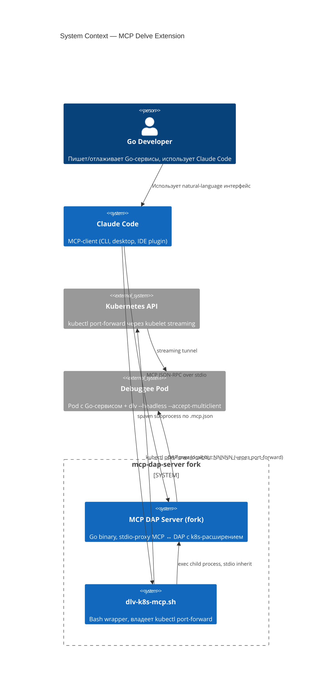
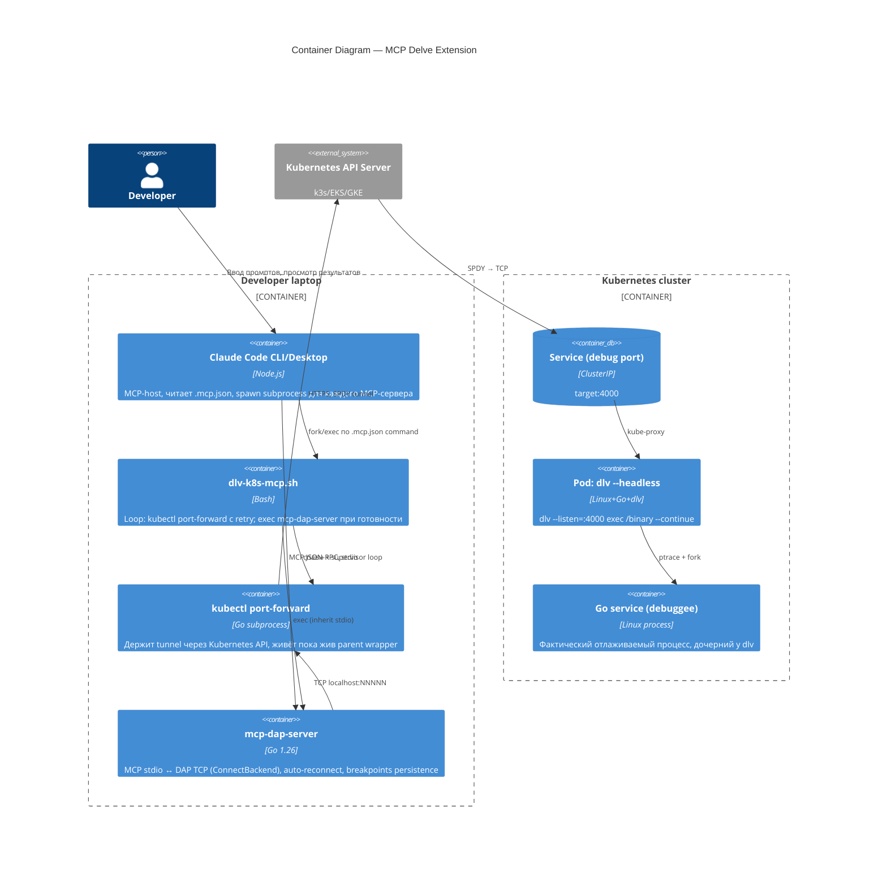
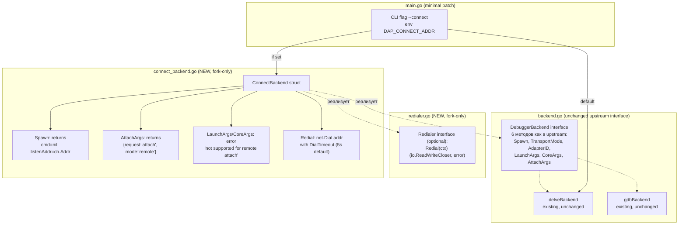
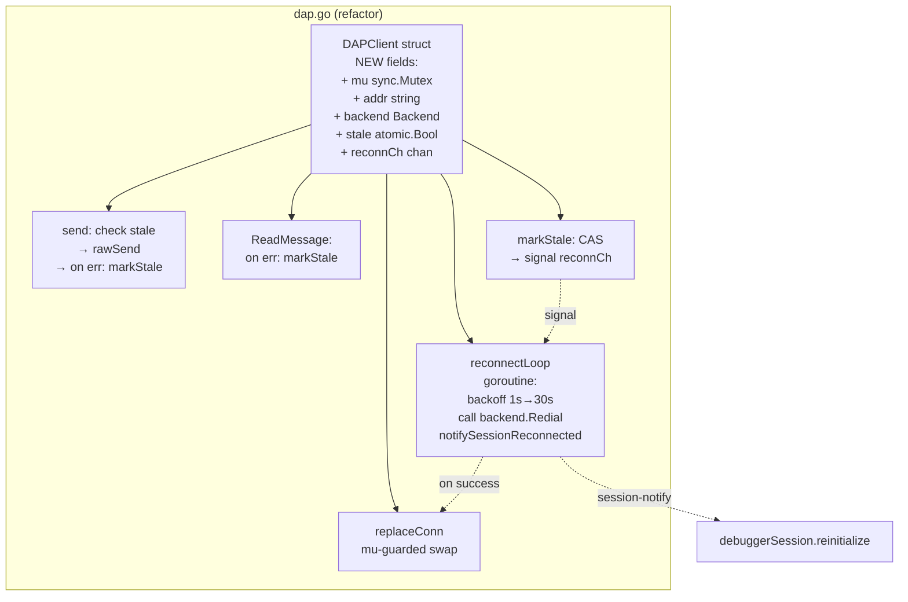
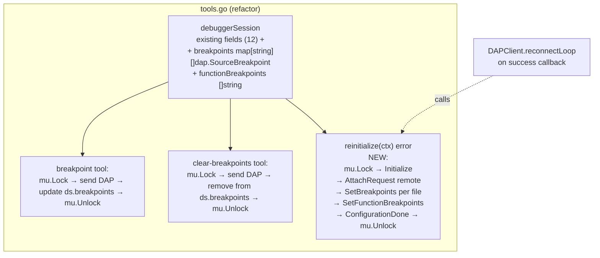
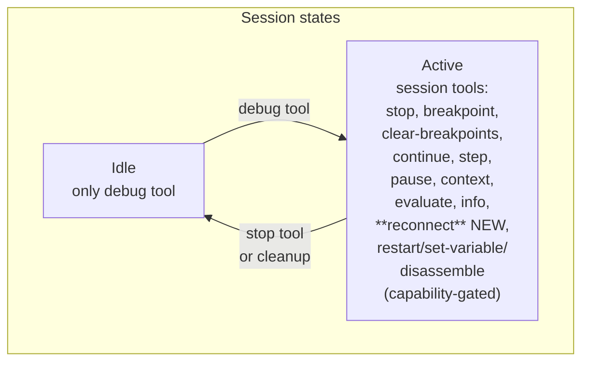
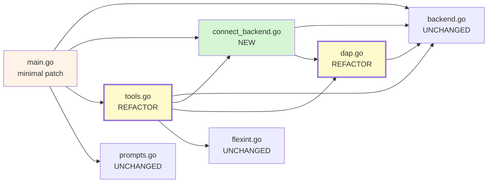

# Architecture: MCP Delve Extension для Kubernetes

## C4 Level 1 — System Context

**WHO** использует фичу и **WHAT** внешние системы в неё вовлечены.



### Context Description

- **Actors**: Go Developer (конечный пользователь); Claude Code (AI-ассистент, от имени разработчика).
- **System boundaries**: **inside the fork** — MCP-сервер (Go binary) + bash wrapper (shell-скрипт); **outside** — Claude Code (не наш код, стандартный MCP-клиент), Kubernetes API, debuggee pod со встроенным Delve.
- **External dependencies**:
  - `kubectl` в `$PATH` на машине разработчика (для port-forward)
  - Доступ к Kubernetes API по пользовательскому `~/.kube/config` (RBAC)
  - Pod с Go-сервисом собран из devel-Dockerfile, где CMD запускает `dlv --headless --accept-multiclient --listen=:4000 exec /binary --continue`
  - Delve версии ≥ v1.7.3 внутри образа (требование DAP remote-attach support)

## C4 Level 2 — Container

**WHAT** процессы/контейнеры задействованы и **HOW** они взаимодействуют.



### Container Description

- **Claude Code**: не наш код. Запускает MCP-сервер по `command` из `.mcp.json`, с `env` из той же конфигурации. Управляет stdio потоками.
- **dlv-k8s-mcp.sh** (наше): single entrypoint. Разделяет ответственность — shell владеет сетью (port-forward), Go — владеет DAP-логикой (separation of concerns).
- **kubectl port-forward** (спаун dlv-k8s-mcp.sh): живёт внутри supervisor-loop; при выходе с non-zero — wrapper ждёт `DLV_RECONNECT_INTERVAL` секунд и перезапускает.
- **mcp-dap-server** (наш форк): главный компонент. Подключается через TCP к `localhost:$DLV_PORT`, выполняет DAP remote-attach, регистрирует session MCP-tools, ведёт `debuggerSession.breakpoints` map, фонит `reconnectLoop` goroutine для stale-recovery.
- **Service + Pod + Go service**: существующая инфраструктура потребителя. Service публикует debug-port через `kube-proxy`, Delve работает внутри pod'а и управляет отлаживаемым процессом через ptrace.
- **Communication**: MCP stdio JSON-RPC (Claude ↔ mcp-dap-server); DAP JSON over TCP (mcp-dap-server → localhost → kubectl → k8s API → pod:4000); kubectl SPDY upgrade (стандартный kubelet streaming).

## C4 Level 3 — Component (внутри `mcp-dap-server`)

**WHAT** внутренние компоненты/модули обрабатывают логику фичи.

### Component 3.1: Backend layer (`backend.go` + новые `connect_backend.go` + `redialer.go`)



**Description**:
- **`DebuggerBackend` НЕ расширяется.** Существующий upstream-interface (backend.go:15-36) сохраняется как есть — это критично для upstream PR (отсутствие interface-widening делает PR additive-only).
- **Новый опциональный interface `Redialer`** объявлен в `dap.go` (или новом `redialer.go`):
  ```go
  // Redialer is an optional capability for backends that support
  // reconnecting to an already-running DAP server (e.g. ConnectBackend).
  type Redialer interface {
      Redial(ctx context.Context) (io.ReadWriteCloser, error)
  }
  ```
  `DAPClient.reconnectLoop` использует Go-идиоматичный type-assertion: `if r, ok := backend.(Redialer); ok { conn, err := r.Redial(ctx) ... }`. Это тот же паттерн, что `io.WriterTo`, `io.StringWriter` в stdlib.
- `delveBackend`/`gdbBackend` — **не реализуют** `Redialer` (никаких stub-методов "not supported" не нужно). При `--spawn` backend'ах reconnectLoop видит `ok=false` и прекращает попытки reconnect (шлёт `ErrReconnectUnsupported` в логи).
- `ConnectBackend` реализует **оба**: `DebuggerBackend` (для стандартного flow через tools.go) + `Redialer` (для reconnect flow).
- `ConnectBackend.Spawn()` возвращает `cmd=nil`, `listenAddr=cb.Addr`, `err=nil` — процесс не спавнится, но существующий TCP-connect flow в `tools.go:840-856` сработает без изменений (nil-guards уже присутствуют: `tools.go:750, 757`).
- `ConnectBackend.AttachArgs(_)` возвращает `{"request":"attach","mode":"remote"}` — PID игнорируется, это **официальный** DAP remote-attach к `dlv --headless` серверу (Delve ≥ v1.7.3).
- `ConnectBackend.LaunchArgs` / `CoreArgs` возвращают ошибку: эти режимы несовместимы с remote-attach.

Rationale для двух-interface'ного подхода — см. [03-decisions.md ADR-10](03-decisions.md).

### Component 3.2: DAP transport layer (`dap.go`, refactor)



**Description**:
- Существующие поля (`rwc`, `reader`, `seq`) **расширяются** 5 новыми.
- `send()` (существующий `dap.go:139-141`) переименовывается в `rawSend`; новый `send` добавляет pre-check `stale` и post-on-error `markStale`.
- `ReadMessage()` (`dap.go:93-95`) — оборачивается для вызова `markStale` при I/O error.
- `markStale()` — idempotent через `CompareAndSwap`, шлёт non-blocking signal в `reconnCh` (buffered 1).
- `reconnectLoop(ctx)` — запускается в `newDAPClient` / `newDAPClientFromRWC` (новая goroutine); при signal крутит `backend.Redial` с exponential backoff 1s→30s; при успехе `replaceConn` + вызов session-callback.
- `replaceConn` — mu-guarded swap `rwc` и `reader`. `seq` **не** сбрасывается: DAP-сессия после `Initialize` начинает отсчёт с любого значения, и новые запросы получают новые seq — это корректно.

### Component 3.3: Session state (`tools.go`, refactor)



**Description**:
- Существующий `debuggerSession` struct (`tools.go:17-31`) расширяется двумя полями:
  ```go
  breakpoints         map[string][]dap.SourceBreakpoint  // file path → specs
  functionBreakpoints []string                            // function-name BPs
  ```
- `breakpoint` tool (`tools.go:1255-1299`) — после успешного `SetBreakpointsRequest` **также** обновляет `ds.breakpoints[file]` (всё под существующим `ds.mu`, tools.go:1257).
- `clear-breakpoints` tool (`tools.go:325+`) — синхронно удаляет запись из `ds.breakpoints`.
- **Новая функция**:
  ```go
  // reinitialize performs full DAP handshake against the (re-)connected
  // adapter and re-applies all persistent state (breakpoints). Called by
  // DAPClient.reconnectLoop on successful Redial.
  // Lock ordering: acquires ds.mu for the entire operation (see ADR-13).
  func (ds *debuggerSession) reinitialize(ctx context.Context) error
  ```
- `reinitialize(ctx)` соблюдает DAP-ordering: `InitializeRequest` → `AttachRequest{mode: "remote"}` → ждёт `InitializedEvent` → все `SetBreakpointsRequest` / `SetFunctionBreakpointsRequest` → `ConfigurationDoneRequest`. Держит `ds.mu` на всю последовательность (ADR-13) — параллельные tool-методы ждут на mu, что корректно, т.к. они всё равно получили бы `ErrConnectionStale`.
- При partial failure (например, Delve restart mid-reinit): возвращает error → `reconnectLoop` оставляет `stale=true` → следующий backoff-tick пытается полный reinit с нуля (ADR-14).

### Component 3.4: MCP tools lifecycle (`tools.go`, расширение)



**Description**:
- Существующий механизм dynamic registration (`registerSessionTools` в `tools.go:93-186` и `unregisterSessionTools` в `tools.go:189-196`) **переиспользуется без рефакторинга** — просто добавляется ещё одна запись в `sessionToolNames()` и `registerSessionTools()`.
- Tool `reconnect` — **не** capability-gated: он оперирует нашим состоянием (`DAPClient.stale`), а не DAP-адаптера.
- Tool `reconnect` параметры: `{force?: bool, wait_timeout_sec?: int}`. При `force=true` — принудительный `markStale`; иначе no-op при `stale=false`. Ожидает восстановления до `wait_timeout_sec` (default 30).

## Module Dependency Graph



**Зависимости (все типы references, не import'ы — проект монопакетный `main`)**:
- `main.go` → `backend`, `connect`, `tools`, `prompts` — composition root, знает про все compontents.
- `tools.go` → `backend` (interface `DebuggerBackend`), `connect` (`*ConnectBackend` в switch), `dap` (`*DAPClient`), `flexint` (в tool params).
- `connect_backend.go` → `backend` (реализует `DebuggerBackend`), `dap` (реализует `Redialer`).
- `dap.go` → `backend` (знает про интерфейс для reconnectLoop callback `Redialer`). **Примечание**: в текущем монопакете это compile-time type reference, не import-path dependency. При upstream PR пакет может разделиться — тогда зависимость станет explicit `import`.
- `prompts.go`, `flexint.go` — не трогаются.

**Легенда fill-цветов**:
- 🟢 зелёный — **NEW** файл (`connect_backend.go`, также и `redialer.go` если будет вынесен из `dap.go`).
- 🟡 жёлтый / bold — **REFACTOR** существующего файла (`dap.go`, `tools.go`).
- 🟠 оранжевый — **MINIMAL PATCH** (`main.go` — только парсинг `--connect` флага и env).
- прочие — **UNCHANGED**.

**Rules для upstream PR первой ступени**:
- `backend.go` должен остаться **бит-в-бит** как в upstream master (upstream diff size = 0 для этого файла).
- Новая функциональность полностью в `connect_backend.go` + `redialer.go` (≈150 строк) + точечный патч в `main.go` (≈20 строк).
- `dap.go`/`tools.go` — изменения для auto-reconnect — идут следующими ступенями (§8 design-doc), PR в upstream обсуждается отдельно.
