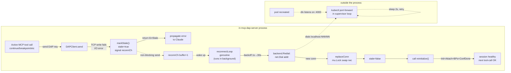
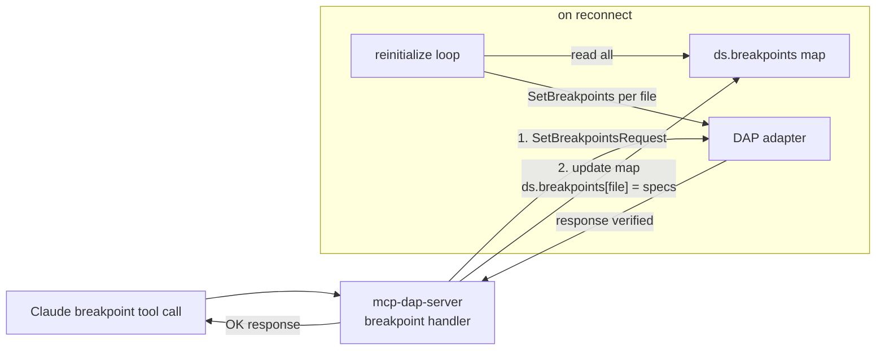
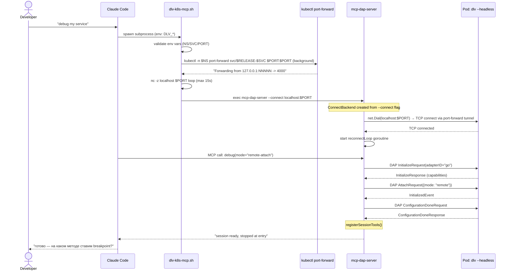
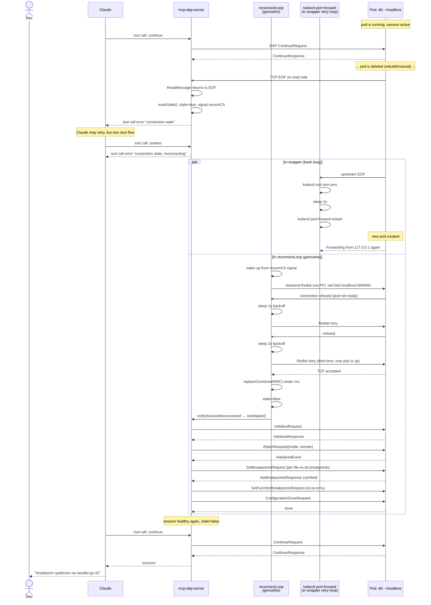
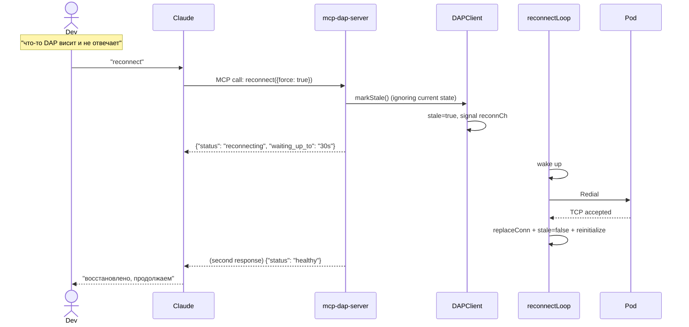
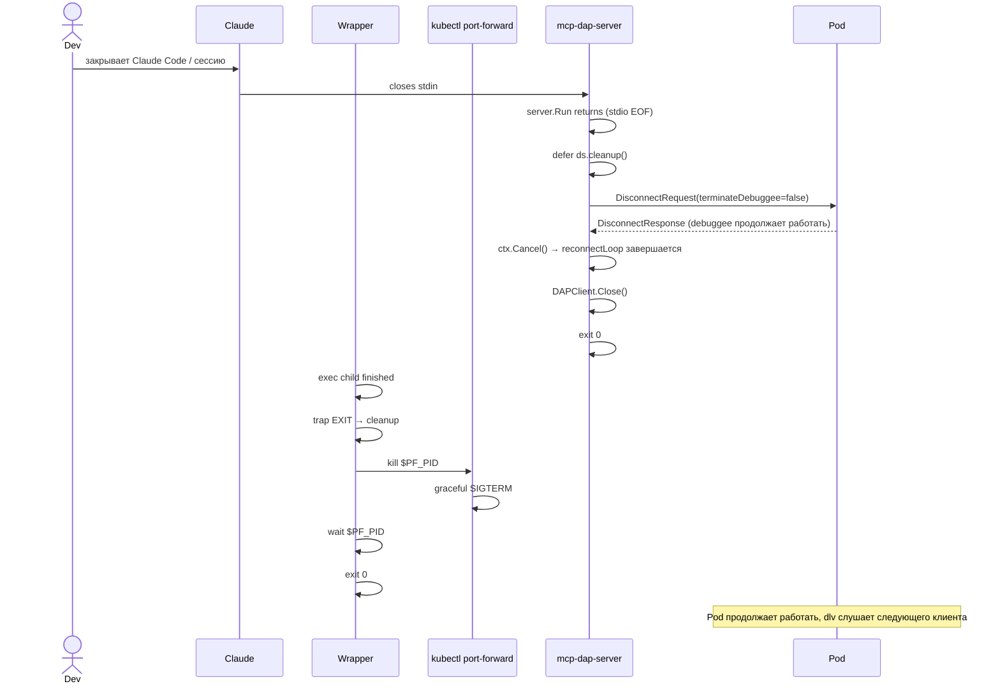

# Behavior: MCP Delve Extension для Kubernetes

## Data Flow Diagrams

### DFD 1: Normal debug flow (happy path)

```mermaid
flowchart LR
    Dev[Developer] -->|"natural language prompt"| Claude[Claude Code]
    Claude -->|"MCP tool call<br/>(JSON-RPC stdio)"| MCP[mcp-dap-server]
    MCP -->|"DAP request<br/>(TCP write)"| PF[kubectl port-forward]
    PF -->|"SPDY tunnel"| K8s[K8s API Server]
    K8s -->|"TCP proxy"| Svc[Service]
    Svc --> Pod[Delve in pod]
    Pod -->|"ptrace"| Proc[Go process]

    Proc -.->|"DAP event<br/>(StoppedEvent)"| Pod
    Pod -.->|"TCP write"| Svc
    Svc -.-> K8s
    K8s -.-> PF
    PF -.-> MCP
    MCP -.->|"JSON-RPC response<br/>+ formatted output"| Claude
    Claude -.->|"natural-language<br/>summary"| Dev

    style MCP fill:#d5f5d5
    style PF fill:#f5f5d5
```

**Входы/выходы**:
- `Developer` → `Claude` — естественный язык ("set a breakpoint at handler.go:42")
- `Claude` → `MCP` — MCP-tool call в JSON-RPC формате (пример: `{"method": "tools/call", "params": {"name": "breakpoint", "arguments": {"file": "/path/handler.go", "line": 42}}}`)
- `MCP` → `Pod` — DAP request по TCP (пример: `{"seq": 5, "type": "request", "command": "setBreakpoints", "arguments": {...}}`)
- Ответы идут обратно по той же цепочке (пунктиром).

### DFD 2: Auto-reconnect flow

**Ключевые переходы**:
1. Любой I/O error на `send` или `ReadMessage` → `markStale` → сигнал в буферизованный `reconnCh` (size=1; без блокировки).
2. Фоновая `reconnectLoop` просыпается; `ctx.Done()` не наступает (shutdown не требуется) → `backend.Redial` с exponential backoff.
3. Успешный `Redial` → `replaceConn` подменяет внутренний `rwc` под `DAPClient.mu.Lock`.
4. `reinitialize()` переприменяет `Initialize` + `Attach{mode: remote}` + все сохранённые breakpoints + `ConfigurationDone`.
5. Claude на следующем tool-call видит успешный ответ без какого-либо индикатора восстановления.

### DFD 3: Breakpoint lifecycle

## Sequence Diagrams

### Seq 1: Initial connect (happy path)

**Error cases**:

| Условие | Поведение | MCP-ответ |
|---------|-----------|-----------|
| `DLV_*` env vars не заданы | Wrapper exit с `set -u` ошибкой | Claude видит non-zero exit spawned subprocess |
| `kubectl port-forward` сразу падает (нет service/namespace) | Wrapper крутит retry loop 15 сек, `nc -z` timeout | Wrapper exit 1 с сообщением `timeout: localhost:NNNNN не открылся` |
| Delve версия < v1.7.3 | `AttachRequest{mode: "remote"}` отклоняется | DAP `ErrorResponse`, MCP возвращает error в tool-call ответе |
| TCP connect успешен, но Delve не отвечает | `InitializeRequest` timeout (реализовать DialTimeout + read deadline) | tool-call возвращает error |

**Edge cases**:
- Очень медленный pull образа → kubectl port-forward `Forwarding from...` печатает, но `nc -z` пока не проходит. Wrapper загружен на 15 сек, этого обычно хватает.
- Быстрый рестарт pod'а до первого tool-call: `InitializeRequest` может попасть в момент TCP-drop → error, Claude получит сообщение, пользователь повторит.

### Seq 2: Pod restart + auto-reconnect

**Error cases**:

| Условие | Error Code | Поведение |
|---------|-----------|-----------|
| Backoff превысил 30s cap | — | `reconnectLoop` продолжает дёргать с max backoff до получения `ctx.Done()` или успеха; Claude получает stale-ошибки; `reconnectAttempts` инкрементируется и доступен через `reconnect` tool |
| После Redial `InitializeRequest` фейлится (например, Delve ещё не готов) | — | reinitialize возвращает error, остаётся в markStale-state, loop пробует снова |
| **Partial failure in reinitialize** (успешно выполнились `Initialize` + `AttachRequest`, но `SetBreakpointsRequest` для 2-го из 5 файлов упал) | — | reinitialize возвращает error, **не оставляет "полу-применённое" состояние**. `reconnectLoop` на следующем backoff-tick делает полный reinit с нуля — `Initialize` в Delve всегда стартует с чистого BP-состояния, поэтому наш снапшот корректно восстанавливается без side-effects. Лог: `reinitialize: N of M breakpoints applied, failed at <file>, retrying full reinit` (см. ADR-14). |
| В момент reconnect пришёл параллельный tool-call | `ErrConnectionStale` | `send` возвращает ошибку сразу (pre-check `stale`) — **fast-fail без блокировки** `ds.mu`. Claude видит clear error message, может retry или вызвать `reconnect` tool (ADR-16) |
| Backend не поддерживает Redial (например, SpawnBackend после TCP drop) | — | `reconnectLoop` делает type-assertion `backend.(Redialer)`; `ok=false` → шлёт warning в log (`reconnect not supported for backend type X`) и остаётся в stale-state. Для SpawnBackend это редкий сценарий: если `dlv dap` subprocess умирает, `cmd.Wait()` в `cleanup()` уберёт его, и пользователю нужно новое `debug()` |

**Edge cases**:
- **Очень быстрый pod restart** (< 2s): backoff ещё 1s, Redial успешный сразу. OK.
- **Pod всё время фейлится** (bad image, ImagePullBackOff): reconnectLoop в вечном цикле при 30s-capped backoff. Пользователь наблюдает прогресс через:
  - stderr wrapper'а — каждая неудача port-forward логируется
  - `$TMPDIR/mcp-dap-server.log` — reconnectLoop attempts
  - `reconnect` tool response — возвращает `attempts: N, last_error: "..."` (ADR-15)
  Ручной `reconnect(force=true)` не поможет — это другой failure mode (надо фиксить образ), но пользователь видит, **почему** сессия не восстанавливается. Recommendation: `stop` + исправить образ + `debug` заново.
- **Wrapper убит (SIGKILL)**: Claude получает EOF на stdin MCP-сервера → server.Run завершается → `defer ds.cleanup()` → `ctx.Cancel()` → `reconnectLoop` завершается через `ctx.Done()` за < 100ms.

### Seq 3: Manual `reconnect` tool invocation

**Semantics of `reconnect` tool**:

| Входной параметр | Поведение |
|------------------|-----------|
| `{}` (no args) | Если `stale=true` — sync wait (up to 30s) до healthy. Если `stale=false` — возвращает `{"status": "healthy"}` сразу |
| `{force: true}` | Всегда `markStale()` + sync wait; используется, если Claude подозревает зависание |
| `{wait_timeout_sec: 60}` | Переопределяет timeout ожидания healthy (default 30s) |

**Edge cases**:
- Вызов `reconnect` во время активного reinitialize (race) — mu-guarded в `replaceConn` + идемпотентный `markStale` (CAS) обеспечивают корректность.
- Timeout ожидания healthy → tool возвращает `{"status": "still_reconnecting"}` без ошибки. Claude может решить retry или stop.

### Seq 4: Graceful shutdown

**Error cases**:
- `DisconnectRequest` упал (TCP уже drop) → лог, но cleanup продолжается.
- `kill $PF_PID` не сработал → `wait` с fallback timeout — здесь `wait` без timeout в bash, но child обычно завершается за < 1s на SIGTERM.

## Дополнительные сценарии

### Edge: Concurrent MCP-tool call во время reconnect

**Trigger**: Claude шлёт `context` tool call, пока `reconnectLoop` в середине `reinitialize` (между `Initialize` и `ConfigurationDone`).

**Behavior (ADR-13 + ADR-16)**:
1. Tool-method (`context`) первой строкой лочит `ds.mu` (`tools.go:1046`).
2. **Если** `reinitialize` уже захватил `ds.mu` (в начале своей работы) — tool-method ждёт на `ds.mu.Lock()`. Это нормально: пока reinit не закончен, tool всё равно не мог бы сделать ничего осмысленного.
3. **Или** — более частый случай — reinitialize ещё не начался, `stale=true` взведён, но `reconnectLoop` ещё на backoff-sleep. Тогда tool-method лочит `ds.mu`, вызывает `ds.client.send(...)`, тот делает pre-check `stale=true` → возвращает `ErrConnectionStale` **без вхождения в сеть**. Tool возвращает ошибку Claude'у (ADR-16, fast-fail).
4. После отпускания `ds.mu` — один из ждущих (reinit или следующий tool-call) его захватит в порядке sync.Mutex (fifo не гарантируется, но в практике — либо-либо).

**Lock-ordering guarantee (ADR-13)**: код везде использует цепочку `ds.mu` → `DAPClient.mu`, никогда наоборот. `DAPClient.send` берёт `DAPClient.mu` на короткое время для swap `rwc` + `rawSend`. `reinitialize` (под `ds.mu`) делает много `send`'ов — каждый берёт/отпускает `DAPClient.mu` отдельно, что correct.

**Race-free инвариант**: итерация по `ds.breakpoints` в `reinitialize` происходит **под `ds.mu`**; tool-method `breakpoint` тоже под `ds.mu` — значит, мутации и чтения map не могут пересекаться (Go race detector'ом verified, см. 04-testing.md `TestReinitialize_ConcurrentBreakpointMutation_NoRace`).

### Edge: Breakpoint drift после code change

**Trigger**: pod rebuilded с новыми инструкциями (между restart'ами разработчик git-pull'ил изменения). Breakpoint на `handler.go:42` теперь попадает на другую инструкцию — например, посреди другого statement.

**Behavior**: `SetBreakpointsRequest` пройдёт успешно (file:line валидно в новом бинаре). Delve поставит BP в ближайшую valid instruction — может отличаться от того, что ожидал пользователь. Это **Delve-side** поведение, не наша ответственность, но в README форка предупреждаем.

### Edge: Параллельный DAP-клиент установил свой breakpoint

**Trigger**: второй разработчик подключился к тому же `dlv --headless --accept-multiclient`, поставил BP в `handler.go:42`. Наш `reinitialize` после reconnect вызывает `SetBreakpointsRequest(handler.go, [<наши lines>])` — DAP-протокол требует, чтобы этот вызов **заменял** список BP для файла; чужой BP затрётся.

**Behavior**: документируем в README как known limitation. Рекомендация: один пользователь на один debuggee (социальное соглашение, не техническое ограничение).
