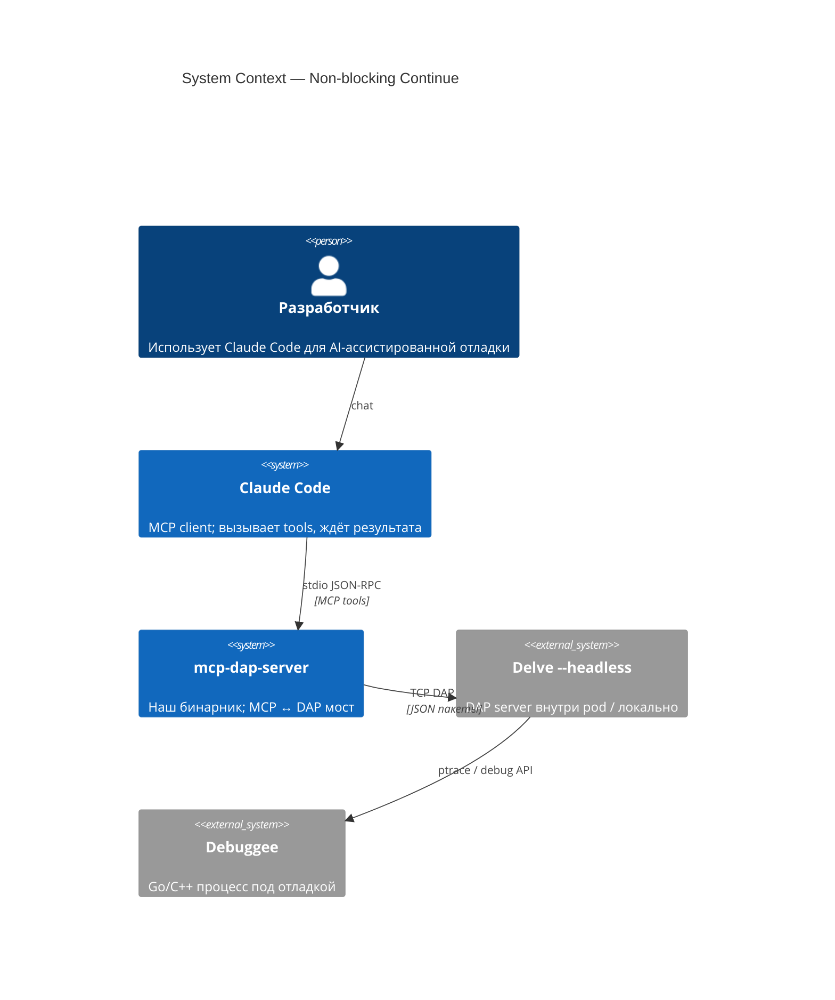
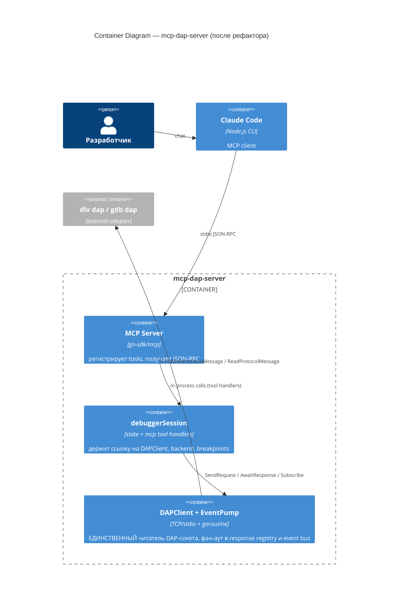
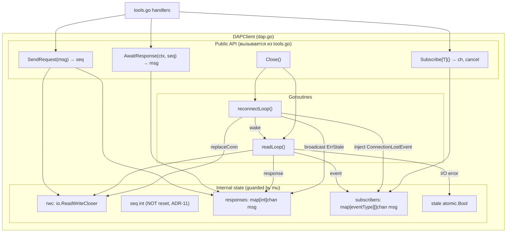
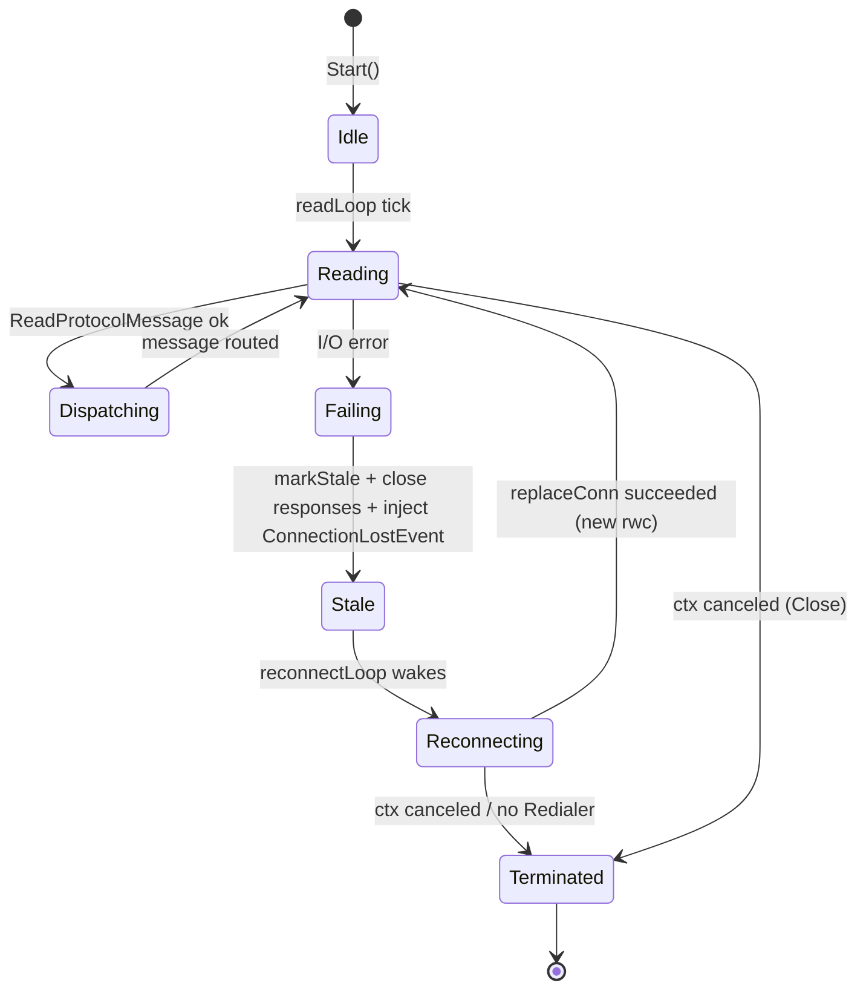
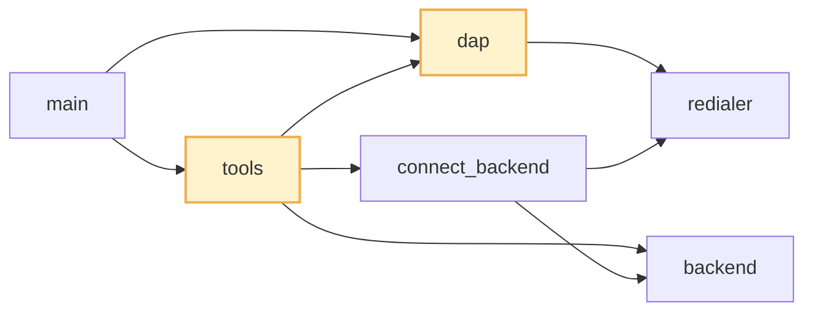

# Architecture: Non-blocking Continue + Event Pump

## C4 Level 1 — System Context

Контекст совпадает с `mcp-delve-extension-for-k8s/01-architecture.md`: актор Claude Code (MCP-клиент) общается с `mcp-dap-server` через stdio JSON-RPC, сервер проксирует в DAP-adapter (Delve / GDB). Изменения фичи чисто внутренние — внешний контекст сохраняется. Диаграмма воспроизведена для полноты.



## C4 Level 2 — Container

`mcp-dap-server` — один Go-бинарник. Фича меняет внутреннюю структуру пакета `main`, но не добавляет новых контейнеров и не перекраивает транспорт.



Новый contract между `debuggerSession` и `DAPClient`:

- `SendRequest(req) (seq int, err)` — пишет сообщение, регистрирует response-канал под `seq`.
- `AwaitResponse(ctx, seq) (dap.Message, error)` — блокирует до ответа в канале под `seq` или до `ctx.Done()` / closed channel (stale).
- `Subscribe[T dap.EventMessage]() (<-chan T, func() unsubscribe)` — подписка на конкретный тип event'а; буфер 64.
- `ReadMessage` удаляется из публичной поверхности (отмечен deprecated в Phase 1, удалён в Phase 2).

## C4 Level 3 — Component

### Component 3.1 `DAPClient` (после рефактора)



**Ключевые инварианты:**

1. **Single reader.** Единственное место, где вызывается `dap.ReadProtocolMessage` — `readLoop`. Все остальные пути идут через канал.
2. **Seq под `mu`.** `newRequest()` уже берёт `mu` (`dap.go:215-218`) — сохраняется.
3. **Registry атомарно.** Регистрация канала в `responses[seq]` происходит в `SendRequest` _до_ записи в сокет — чтобы `readLoop` не мог получить ответ раньше, чем канал создан. Если запись в сокет провалилась — канал удаляется (cleanup).
4. **Event fan-out.** Events клонируются в каждого подписчика. Буфер 64 выбран с запасом: реальные burst'ы (handshake + stopped → continued → stopped) укладываются в ≤10 событий, но memory cost буфера незначителен (~16 KB на подписчика), поэтому выбираем щедро, чтобы исключить драпы при нестандартных нагрузках (много BreakpointEvent при re-apply 100+ breakpoint'ов). Если подписчик всё же не успевает — drop с логом (приоритет: не блокировать pump).
5. **Stale propagation.** При I/O-ошибке `readLoop`:
   - вызывает `markStale()`;
   - закрывает все response-каналы (получатели видят `recv ok=false` → `ErrConnectionStale`);
   - шлёт `ConnectionLostEvent{}` во все subscriber-каналы (информационно).
6. **Lifetime.** `readLoop` запускается в `Start()` (после `SetReinitHook`, сохраняя гарантии ADR Issue 1 существующего дизайна) и выходит только на `ctx.Done()` (через `Close()`).

### Component 3.2 `debuggerSession` (изменения)

```mermaid
flowchart TB
  subgraph session["debuggerSession (tools.go)"]
    direction TB
    Mu["mu sync.Mutex"]
    BPs["breakpoints map[file][]spec"]
    FBPs["functionBreakpoints []string"]
    Caps["capabilities"]
    ThrID["stoppedThreadID"]
    FrID["lastFrameID"]

    subgraph Handlers["Tool handlers"]
      Cont["continueExecution"]
      Wait["waitForStop (NEW)"]
      Pause["pauseExecution"]
      Step["step"]
      Others["evaluate, context, info, ..."]
      Reinit["reinitialize"]
    end
  end

  Cont -->|lock mu| SendReq["DAPClient.SendRequest ContinueRequest"]
  Cont -->|AwaitResponse(seq)| ContResp["ContinueResponse (≤1s)"]
  Cont -->|unlock mu before returning| Return1["return running"]

  Wait -->|Subscribe StoppedEvent+TerminatedEvent| Bus
  Wait -->|ctx with timeout| Timeout["timeout or stop event"]

  Pause -->|lock mu| SendReq2["DAPClient.SendRequest PauseRequest"]
  Pause -->|AwaitResponse| PauseResp["PauseResponse"]

  Reinit -->|lock mu| RawSend["SendRequest (bypass stale fast-check)"]
  Reinit -->|AwaitResponse per step| ReinitOK["InitializeRequest → AttachRequest → Initialized Event (Subscribe) → setBreakpoints×N → ConfigurationDone"]
```

**Изменения в `ds.mu` scope:**

- `continueExecution` — держит `mu` только на время `SendRequest(ContinueRequest)` + `AwaitResponse(contSeq)`. После получения `ContinueResponse` — отпускает `mu` и возвращает результат. StoppedEvent теперь ожидает _другой_ tool (`waitForStop`), который приобретает `mu` отдельно.
- `pauseExecution` — работает ровно как сейчас: `lock mu` → `SendRequest(Pause)` → `AwaitResponse`. Разница: теперь `mu` доступен, пока программа бежит.
- `waitForStop` — НЕ держит `mu` во время ожидания event'а; использует `DAPClient.Subscribe`, который thread-safe через свой мьютекс. Захватывает `ds.mu` только для обновления `stoppedThreadID` / `lastFrameID` при приёме события.
- `reinitialize` — держит `mu` всё время handshake (как сейчас, ADR-13 сохраняется); внутри использует `SendRequest` (raw-вариант без stale fast-check) + `AwaitResponse` + `Subscribe[*InitializedEvent]`.

### Component 3.3 readLoop state machine



**Почему НЕ выделяем отдельную горутину `eventDispatcher`:** fan-out дешёвый (map lookup + non-blocking send), и один читающий поток проще для reasoning о lock-ordering. Если в будущем появится bottleneck — можно добавить `dispatchCh chan dap.Message` между `readLoop` и диспетчером, но без реальной нагрузки это преждевременная оптимизация.

## Module Dependency Graph



- **Меняются:** `dap.go` (пакет event-pump + registry + subscriptions), `tools.go` (все хендлеры через новый API).
- **Не меняются:** `backend.go`, `connect_backend.go`, `redialer.go`, `main.go` (кроме возможного включения логирования в Phase 5), `flexint.go`, `prompts.go`.
- **Правило направления зависимости:** `tools.go` зависит от `dap.go`, но не наоборот. `dap.go` не знает ни о каких MCP-концепциях — только о протоколе DAP.

## Rules

1. **Никто кроме `readLoop` не читает из `rwc`.** Любая попытка в коде (включая тесты) вызывать `dap.ReadProtocolMessage` на боевом клиенте — ошибка, которая должна отлавливаться в ревью.
2. **Seq монотонен через reconnect.** Сохраняем ADR-11: `seq` не сбрасывается при `replaceConn`, чтобы late-ответы с мёртвого сокета не могли сматчиться на новые запросы (на случай, если старый `rwc.Close()` не полностью прибил чтение).
3. **Lock ordering сохраняется.** `ds.mu` → `DAPClient.mu` (ADR-13 baseline). Новый `DAPClient.registryMu` (mutex для `responses` и `subscribers`) — вложен внутрь `DAPClient.mu` или взаимоисключим через отдельные скоупы; конкретика — в 03-decisions.md (ADR-PUMP-3).
4. **Все await'ы принимают `context.Context`.** `AwaitResponse(ctx, seq)` и `waitForStop` используют `ctx` от MCP-handler + таймаут. Это закрывает случай "tool зависает навсегда": снаружи всегда есть deadline.
5. **BREAKING: форк расходится с upstream** (ADR-PUMP-14). Никаких compat-слоёв ради upstream `DebuggerBackend` interface не добавляется. Версия bump'ается до 0.2.0 (ADR-PUMP-13); CHANGELOG.md — первая запись — документирует `continue` без блокировки, новый `wait-for-stop`, удалённый `DAPClient.ReadMessage` из публичного API.
