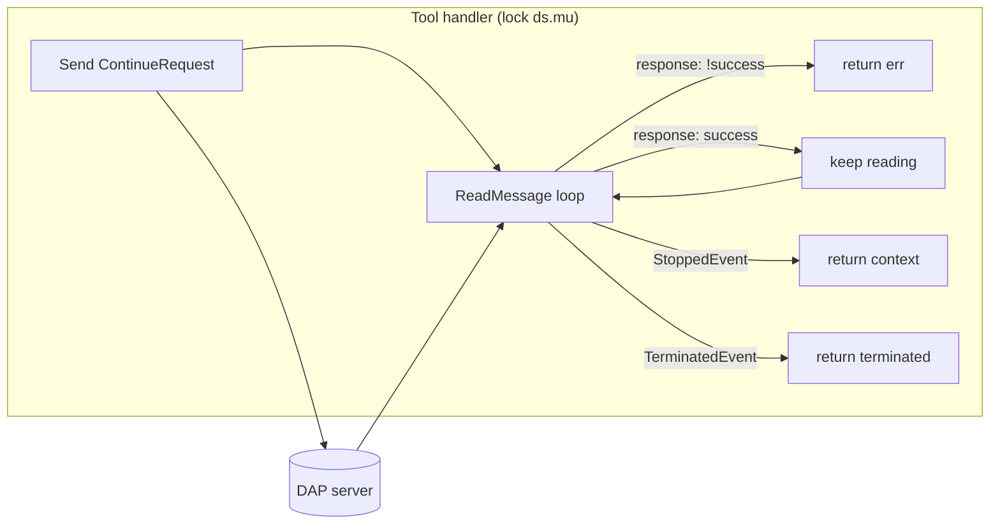
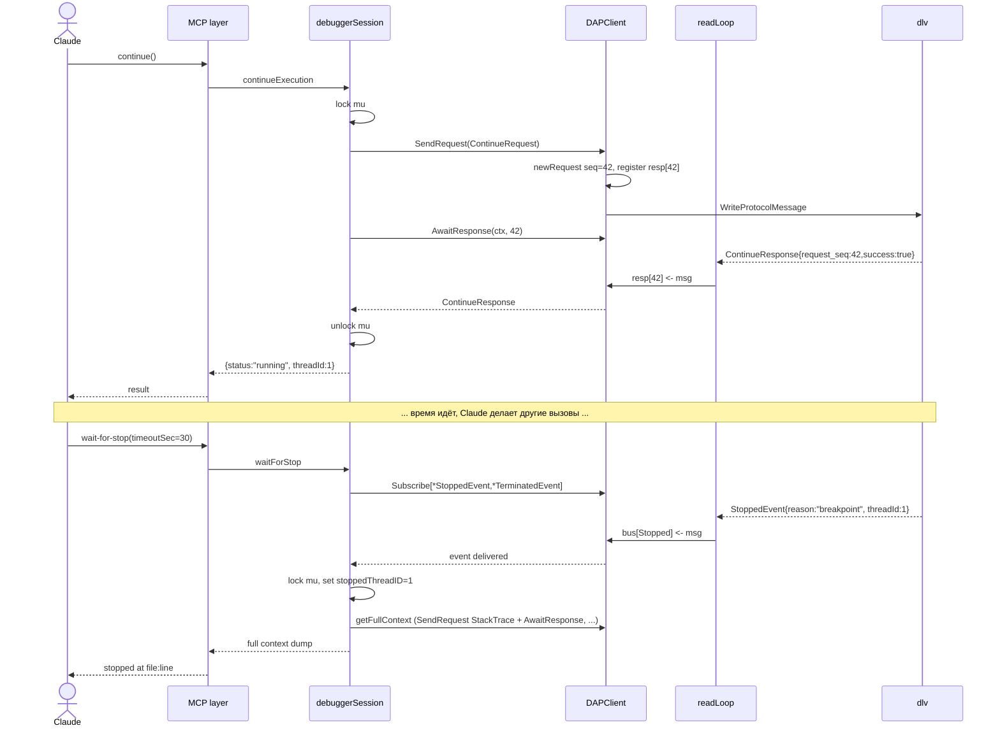
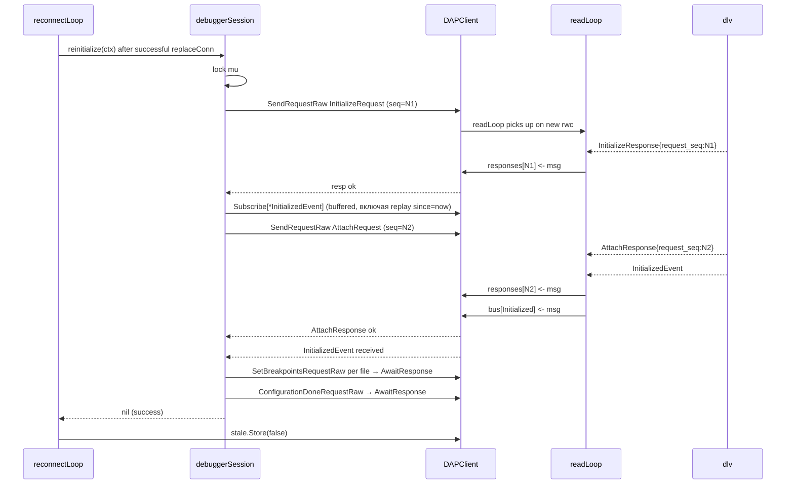

# Behavior: Non-blocking Continue + Event Pump

## Data Flow Diagrams

### DFD-1: Текущая синхронная модель (как есть, `tools.go:457-480`)



**Проблемы:**
- `A2` — один монолитный цикл; `pause` от другого tool-а встать в очередь за `ds.mu`, получить lock только после выхода из `A2` (т.е. после stopped-event). Классический deadlock для "breakpoint не сработает".
- Outbound responses НЕ матчатся: случайный `OutputEvent` или запоздалый ответ другой команды просто крутится через `A3`. Нет строгой привязки "этот ответ — для этого request'а".

### DFD-2: Новая асинхронная модель (event pump)

```mermaid
flowchart LR
  subgraph DAPClient["DAPClient (один процесс-wide pump)"]
    RL[readLoop goroutine] -->|response| REG[responses registry]
    RL -->|event| BUS[event bus]
    RL -->|I/O err| STL[mark stale + close registry + inject ConnectionLostEvent]
  end

  subgraph Tool1["continue handler"]
    C1[SendRequest ContinueRequest]
    C2[AwaitResponse seq]
    C1 --> C2
  end

  subgraph Tool2["wait-for-stop handler"]
    W1[Subscribe StoppedEvent+TerminatedEvent]
    W2[ctx.timeout || event]
    W1 --> W2
  end

  subgraph Tool3["pause handler"]
    P1[SendRequest PauseRequest]
    P2[AwaitResponse seq]
    P1 --> P2
  end

  C1 --> REG
  C2 --> REG
  P1 --> REG
  P2 --> REG
  W1 --> BUS
  W2 --> BUS

  C1 --> DAPServer[(DAP server)]
  P1 --> DAPServer
  DAPServer --> RL
```

**Выигрыш:**
- `continue` и `pause` идут в _разные_ response-каналы → не конфликтуют.
- `wait-for-stop` слушает event-bus, не конфликтует ни с `continue`, ни с `pause` за чтение сокета.
- Out-of-order responses обрабатываются на уровне registry (by `request_seq`) — tool-код больше не пишет skip-циклы.

## Sequence Diagrams

### Seq-1: Normal continue + wait-for-stop (happy path)



**Error cases:**

| Condition | Tool result | Observable |
|---|---|---|
| `ContinueResponse.success=false` | error: "continue failed: {reason}" | `mu` released immediately |
| `wait-for-stop` timeout | `{status:"still_running",elapsedSec:N}` (no exception) | next wait-for-stop continues from present |
| Subscribe получил `ConnectionLostEvent` | error: `ErrConnectionStale` | caller retries after reconnect MCP tool |

**Edge cases:**
- _Event приходит ДО Subscribe_: реальная гонка. `wait-for-stop` может быть вызван уже после stop-event'а, который уже съеден шиной. Решение: `DAPClient.Subscribe` принимает optional `since time.Time` (или `lastSeq`) для replay из кольцевого буфера (размер 64, ADR-PUMP-5). Дефолт `since=now` — получаем только будущие.
- _Множественные stop-events подряд_ (e.g. восстановление после pause, потом breakpoint): каждый wait-for-stop возвращает только один event; следующий вызов ждёт следующий.

### Seq-2: Continue + parallel pause (текущее deadlock-решение)

```mermaid
sequenceDiagram
  par Claude main turn
    Claude->>MCP: continue()
    MCP->>DS: continueExecution (mu briefly)
    DS->>DC: SendRequest Continue → AwaitResponse ContinueResponse
    DS-->>Claude: running
  and Claude parallel turn
    Claude->>MCP: chrome-devtools.new_page(url)
    Note over Claude: в параллельном subagent
  end

  Note over Claude: программа выполняется; breakpoint НЕ срабатывает

  Claude->>MCP: wait-for-stop(timeoutSec=20, pauseIfTimeout:true)
  MCP->>DS: waitForStop
  DS->>DC: Subscribe[StoppedEvent,TerminatedEvent]
  Note over DC: 20s проходит, event не получен
  DC-->>DS: timeout
  DS->>DC: SendRequest(PauseRequest)
  DC-->>DS: PauseResponse
  DAP-->>RL: StoppedEvent{reason:"pause"}
  RL->>DC: bus delivers to still-live subscription
  DC-->>DS: StoppedEvent received
  DS-->>MCP: stopped due to pause timeout
  MCP-->>Claude: "program didn't hit breakpoint in 20s; paused — inspect state"
```

**Ключевое изменение:** `pauseIfTimeout:true` заменяет ручной workflow ("clear-breakpoints → continue → open browser") на один tool-вызов, который либо возвращает реальный stopped-event, либо делает controlled pause и возвращает текущее состояние. Именно это поведение невозможно в текущей синхронной модели — `pause` не может работать во время `continue`.

### Seq-3: Reconnect во время wait-for-stop

```mermaid
sequenceDiagram
  participant DS as debuggerSession
  participant DC as DAPClient
  participant RL as readLoop
  participant Recon as reconnectLoop
  participant K8s as kubectl port-forward
  participant DAP as dlv in pod

  DS->>DC: Subscribe[StoppedEvent] (from wait-for-stop)
  DAP-->>RL: ... (TCP drop, pod restart) ...
  RL->>RL: ReadProtocolMessage → io.EOF
  RL->>DC: markStale + close responses + inject ConnectionLostEvent
  DC-->>DS: subscription delivers ConnectionLostEvent
  DS-->>MCP: error: ErrConnectionStale
  Note over DS: tool returns error; Claude видит "connection stale, reconnect in progress"

  Recon->>K8s: Redial via backend.Redial (dial localhost:24020)
  K8s-->>Recon: new conn
  Recon->>DC: replaceConn(newRWC)
  Recon->>DC: reinitHook (reinitialize)
  DC->>DAP: Initialize → Attach → SetBreakpoints×N → ConfigurationDone (all via SendRequest + AwaitResponse)
  DAP-->>RL: все ответы идут в новый registry
  Recon->>DC: stale.Store(false)

  Note over DS: Claude вызывает reconnect tool
  DS->>DC: poll stale.Load()
  DC-->>DS: healthy
  DS-->>MCP: {"status":"healthy"}

  Note over DS: Claude вызывает wait-for-stop снова
  DS->>DC: Subscribe[StoppedEvent]
  DAP-->>RL: StoppedEvent (если breakpoint сработает)
```

**Error cases:**

| Condition | Behavior |
|---|---|
| Pod never recovers | `reconnectLoop` крутится с backoff до `ctx.cancel()` (Close); каждый `reconnect` tool-вызов возвращает `{status:"reconnecting", attempts:N, lastError:"..."}` |
| `reinitHook` fails (e.g. pod started с другим бинарем) | `notifySessionReconnected` вызывает `markStale()` → цикл повторяется; лог фиксирует причину |
| Subscribe создан ДО drop и висит | получает `ConnectionLostEvent` → возвращается с `ErrConnectionStale` — user знает, что надо retry |

### Seq-4: reinitialize через event-pump



**Ключевое отличие от текущего `reinitialize` (`tools.go:1441-1539`):** убран ручной цикл `for { ReadMessage() switch m.(type) }` (`tools.go:1471-1490`). Вместо этого:
- `InitializedEvent` ловится через `Subscribe[*InitializedEvent]` с `since=attachSent` — replay-буфер гарантирует, что event, пришедший до субскрайба (между `SendRequestRaw(Attach)` и `Subscribe`), не потеряется.
- Любой `OutputEvent` / `ThreadEvent` теперь просто копится в своей шине или отбрасывается, не мешая reinitialize.
- out-of-order responses — concern исключительно registry, tool-код не пишет skip-ов.

## Additional Scenarios

### Scenario: Event burst во время tool-handler'а

**Trigger:** Claude вызывает `context` (который шлёт `StackTraceRequest` + `ScopesRequest` + `VariablesRequest`); в это же время DAP-сервер шлёт `OutputEvent` (например, программа напечатала что-то в stdout) и ThreadEvent (новый goroutine).

**Behavior:** `readLoop` получает события, шлёт в соответствующие шины. Если нет подписчиков на `OutputEvent`/`ThreadEvent` — сообщения молча дропаются (это корректно: они информационные). Response-каналы для `StackTraceRequest` etc. получают свои ответы строго по `request_seq`.

**Edge case:** если у нас в будущем появится tool-stream для OutputEvent — буфер шины должен быть достаточным, чтобы не потерять stdout во время медленного handler'а. В Phase 1 у нас нет подписчиков на `OutputEvent`, так что это не блокер.

### Scenario: Concurrent tool calls

**Trigger:** Claude (или subagent) вызывает `evaluate` и `context` одновременно.

**Behavior:** MCP-framework сериализует JSON-RPC вызовы к одному серверу (по ТЗ go-sdk/mcp), но даже если бы не сериализовал, каждый handler берёт `ds.mu` под короткий scope (SendRequest + AwaitResponse). Registry управляется `DAPClient.registryMu` и поддерживает несколько одновременных `AwaitResponse` (по разным seq). Реально parallel — только `wait-for-stop` (без `ds.mu`) + любой другой tool.

### Scenario: Claude убивает mcp-dap-server (MCP Close)

**Trigger:** Claude Code получает Ctrl-C от пользователя; закрывает stdin нашего сервера.

**Behavior:** `mcp.Server.Run` возвращается; `main.go` дохой `defer ds.cleanup()` → `DAPClient.Close()` → `ctx.cancel()` → `readLoop` и `reconnectLoop` выходят → `rwc.Close()`. Все pending `AwaitResponse` получают `ErrConnectionStale` или `ctx.Err()` в зависимости от того, что сработает первым. Subscribers получают closed channel.
